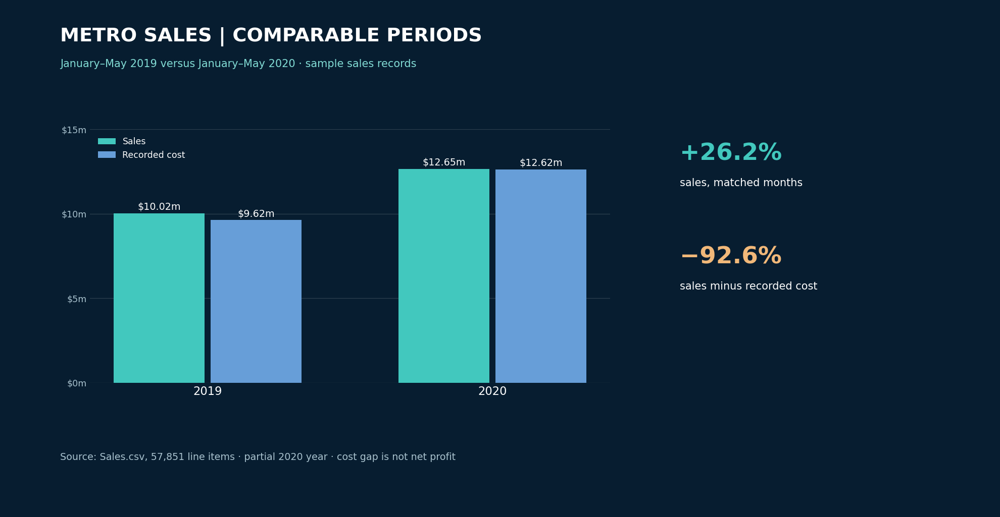

# Metro sales analysis

**Question:** Why did sales grow while the gap between sales and recorded cost nearly disappear?

This project brings together seven supplied sales and lookup tables, a SQL analysis script, an Excel binary workbook and dashboard exports. The `Sales.csv` extract contains 57,851 sales rows. Its fields and salesperson records resemble an AdventureWorks-style sample; the original distributor has not been verified, so avoid claiming actual company performance.

## Method

Use the supplied `Sales.csv`, `Product.csv`, `Region.csv`, `Reseller.csv`, `Salesperson.csv`, `SalespersonRegion.csv` and `Targets.csv` together with [`SQL_CAPSTONE_ONYX_COHORT.sql`](SQL_CAPSTONE_ONYX_COHORT.sql). The CSV exports contain tab-separated fields despite their `.csv` extensions, and monetary values need parsing before aggregation. Check join keys and date ranges before calculating period-on-period change. The Excel workbook is [`my_sql_capstone _FINAL.xlsb`](my_sql_capstone%20_FINAL.xlsb).

## Verified comparison

The supplied `Sales.csv` has dates from July 2017 through May 2020. For a comparable **January–May** window:

| Measure | 2019 | 2020 | Change |
| --- | ---: | ---: | ---: |
| Sales | $10,020,031.05 | $12,650,022.79 | +26.2% |
| Recorded cost | $9,620,904.20 | $12,620,299.50 | +31.2% |
| Sales minus recorded cost | $399,126.85 | $29,723.29 | −92.6% |

This is a **sample-data comparison**, not a claim about a real company. The original “53% revenue decline” statement cannot be reproduced from this comparable period and has been removed. Costs grew faster than sales, so the next investigation should separate product mix, quantity, price and recorded cost changes. Do not call the difference net profit: operating expenses and returns are not represented here.

## Decision use and limits

Start with product and regional cuts for the same calendar months, then inspect rows where `Cost` exceeds `Sales`. The CSV files are tab-delimited despite their `.csv` extension. The project uses sample sales records; confirm provenance before citing the dataset beyond the repository. No recovery intervention or measured business impact is documented.

## Files

| File | Purpose |
| --- | --- |
| [`my_sql_capstone _FINAL.xlsb`](my_sql_capstone%20_FINAL.xlsb) | Excel analysis workbook |
| [`SQL_CAPSTONE_ONYX_COHORT.sql`](SQL_CAPSTONE_ONYX_COHORT.sql) | SQL queries |
| [`images/metro-verified-comparison.png`](images/metro-verified-comparison.png) | Recalculated comparison from source rows |
| [`verify_comparison.py`](verify_comparison.py) | Reproduce the comparison with pandas |
| [`archive/`](archive/) | Earlier dashboard screenshots with an undocumented −53% claim |
| `Sales.csv`, `Product.csv`, `Region.csv`, `Reseller.csv`, `Salesperson.csv`, `SalespersonRegion.csv`, `Targets.csv` | Source exports |

**Analyst:** [Chukwuemeka Ogo](https://mikkymo.github.io/portfolio/) · [LinkedIn](https://www.linkedin.com/in/ogochukwuemeka/)

The Excel binary workbook retains the original exercise and may contain the previous, unverified year-over-year measure. Use the source CSV and reproduction script for the comparison above.
