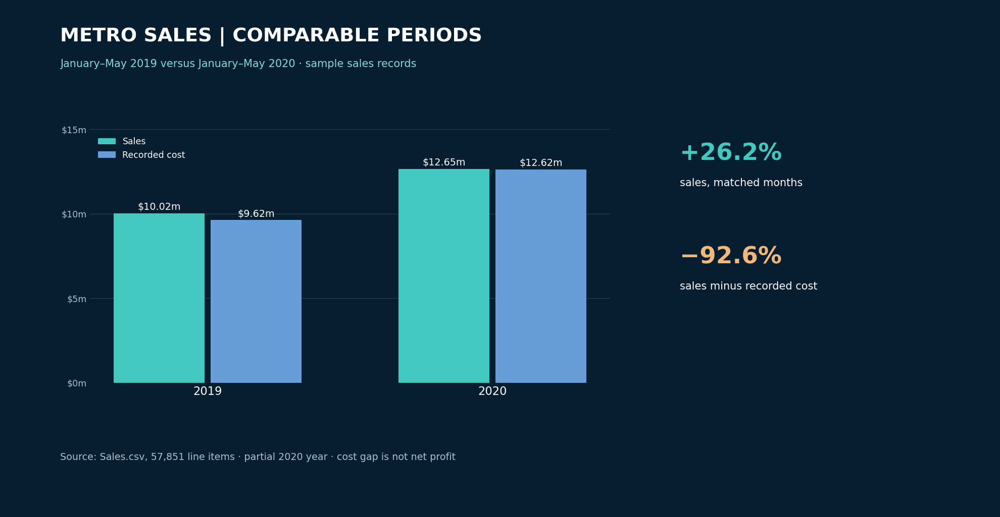

# Metro Sales Analysis
### Sales growth, recorded costs, and commercial performance

A SQL and Excel portfolio case study exploring a practical business question: **does higher sales revenue translate into a stronger financial result?**

The project brings together **57,851 sales records and seven related tables**. In a comparable January–May window, sales increased by **26.2%**, while sales minus recorded cost fell by **92.6%**.

**Tools:** SQL · Excel · Python for verification  
**Analyst:** Chukwuemeka Ogo

**[View dashboards](docs/dashboard-gallery.md)** · [Explore SQL analysis](SQL_CAPSTONE_ONYX_COHORT.sql) · [Read methodology](docs/methodology.md)

## Business question

Which products and regions should a sales manager investigate when sales grow but the amount remaining after recorded costs declines?

The analysis supports a review of sales performance, cost growth, and the areas requiring further investigation.

## Key findings

The comparison uses **January–May in both 2019 and 2020** to avoid comparing a partial year with a full year.

| Metric | Jan–May 2019 | Jan–May 2020 | Change |
| --- | ---: | ---: | ---: |
| Sales | $10,020,031.05 | $12,650,022.79 | +26.2% |
| Recorded cost | $9,620,904.20 | $12,620,299.50 | +31.2% |
| Sales minus recorded cost | $399,126.85 | $29,723.29 | −92.6% |

**Business interpretation:** recorded costs grew faster than sales. Revenue growth therefore did not translate into growth in the amount remaining after those costs.

## Recommended next steps

1. Compare products and regions over the same months to locate the largest changes.
2. Separate changes in quantity, selling price, product mix, and recorded cost.
3. Review records where cost exceeds sales before proposing pricing or cost-control actions.

These are proposed investigations; the project does not establish the cause of the decline or document an implemented business intervention.

## Analytical approach

- Combine sales data with product, region, reseller, salesperson, and target information.
- Use SQL and Excel to explore business performance.
- Recalculate the headline comparison directly from the sales extract using the included Python script.
- Define metrics and comparison periods explicitly.

Read the [methodology and reproduction guide](docs/methodology.md) for calculation details and the [data guide](docs/data-guide.md) for the source-file inventory.

## Explore the project

| Resource | Purpose |
| --- | --- |
| [SQL analysis](SQL_CAPSTONE_ONYX_COHORT.sql) | Original analytical queries |
| [Excel workbook](my_sql_capstone%20_FINAL.xlsb) | Original analysis and dashboard exercise |
| [Verification script](verify_comparison.py) | Reproduce the reported period comparison |
| [Methodology](docs/methodology.md) | Scope, formulas, and reproduction instructions |
| [Data guide](docs/data-guide.md) | Tables, file format, and data limitations |
| [Dashboard gallery](docs/dashboard-gallery.md) | Original dashboard designs and version notes |

## Scope and limitations

This is a sample-data portfolio exercise; the original dataset distributor has not been verified. **Sales minus recorded cost is not net profit**, because operating expenses and returns are not represented. The original workbook and dashboard images retain earlier calculations; the findings above follow the source-based comparison. See the [dashboard version notes](docs/dashboard-gallery.md) for details.

---

[Portfolio](https://mikkymo.github.io/portfolio/) · [LinkedIn](https://www.linkedin.com/in/ogochukwuemeka/)
