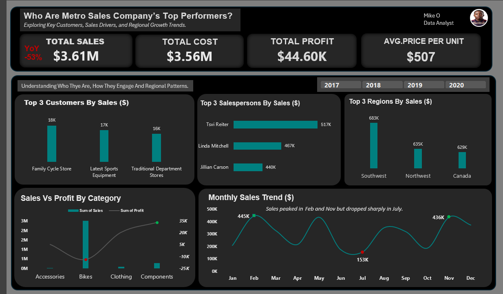
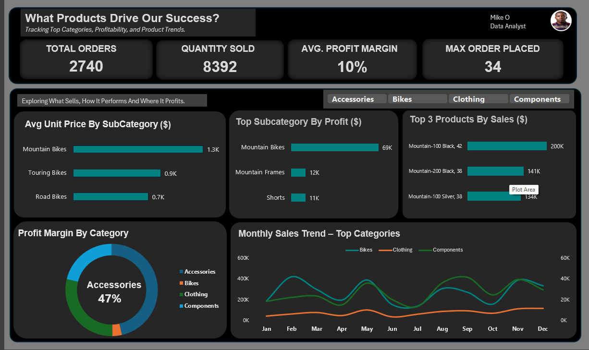

# Dashboard Gallery and Version Notes
[Back to project overview](../README.md)

## Current comparison

This chart presents the January–May comparison reported in the project overview.

## Original dashboard designs

The screenshots below preserve the original Excel dashboard designs. Their historical metric labels and annotations should be read alongside the version notes.

### Sales performance dashboard

### Additional dashboard view

## Version notes

| Item | Current interpretation |
| --- | --- |
| Historical “53% decline” annotation | Not reproduced from the supplied rows in the comparable January–May window; excluded from the current findings |
| Headline period comparison | January–May 2019 versus January–May 2020 |
| Financial difference | Sales minus recorded cost; not net profit |
| Excel workbook | Retains the original exercise and may contain earlier calculations |

The gallery preserves design history. The [project overview](../README.md) and [methodology](methodology.md) identify the comparison used for current reporting.
